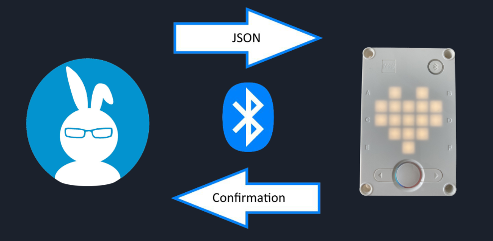

# Lego Spike Accessibility
                
(source: [Lego Spike Website](https://education.lego.com/en-us/products/lego-education-spike-prime-set/45678#spike%E2%84%A2-prime))

This project is an attempt to successfully connect to the Lego Spike kit via Bluetooth and integrate it with the Quorum coding language to provide and implement accessibility features, primarily for blind and visually impaired users. The Quorum programming language has native support for the blind or visually impaired. Once the kit is connected and set up with the Quorum environment, blind and visually imparied users will be able to use screen readers to program the Lego Spike kit.

[Quorum Website](https://quorumlanguage.com/)

# Motivation 
The Lego Spike kit provides an engaging entryway into basic programming using a block-based programming language and Python. These implementations in the Lego Spike app do not natively have accessibility support for the
blind and visually impaired, limiting the Lego Spike’s
usefulness and preventing upcoming robotics students such
as those from the Maryland School for the Blind from
participating the First Lego League, a Lego robotics
competition

# Our Solution
 

Our approach to this was to create two programs that act
as a transmitter on the user’s device, and a receiver on the
Lego Spike kit’s hub.
On the Java side, we access the serial port created after
the Lego Spike hub is paired using the Java library
jSerialComm and open it to read and write data over the
connection.
From the Lego Spike hub, we use a built-in module to
read and write data to a connected device on a virtual
communication port. Read data are parsed to execute
commands on the hub and then the connected device is
responded to with a confirmation message expressing a
successful or unsuccessful command parse.

Currently, we were able to establish a serial connection with the
Lego Spike hub and a computer using a Java program
and send commands as JSON strings, which were then
parsed by the Lego Spike hub and executed. An
implementation of this Java program was added to a beta
branch of Quorum as a plugin for serial connections.
In addition, we successfully implemented parsing of the
Motor and MotorPair commands the Lego Spike hub has
access to.